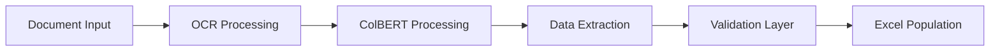

# Automated Document Information Extraction System

## Overview
An intelligent document processing system that automates the extraction of structured data from financial documents using state-of-the-art machine learning models. The system processes multi-page documents, extracts relevant information, and populates Excel templates automatically.

## 🎯 Problem Statement
Financial institutions deal with numerous documents that require manual data extraction and entry into structured formats. This project automates this process, reducing processing time and human error.

## 🚀 Key Features
- **Document Processing Pipeline**
  - Multi-page PDF parsing and OCR processing
  - Intelligent text extraction and classification
  - Automated data validation and error checking
  - Excel template auto-population

- **Advanced ML Capabilities**
  - ColBERT-based document retrieval system
  - Azure OpenAI integration for context understanding
  - PyTesseract for accurate OCR processing
  - Custom NER models for financial data extraction

## 🛠️ Technical Architecture

## 💻 Technology Stack
- **Cloud Infrastructure**
  - Azure Machine Learning for model deployment
  - Azure Blob Storage for document management
  - Azure Functions for serverless operations

- **Core Technologies**
  - Python 3.8+
  - PyTesseract for OCR
  - ColBERT for document understanding
  - Azure OpenAI API
  - Pandas for data manipulation

## 🔧 Implementation Details
- Asynchronous processing pipeline
- Microservices architecture
- REST API endpoints for service integration
- Containerized deployment using Docker
- Automated testing suite

## 📊 Performance Metrics
- Average processing time: < 30 seconds per document
- Accuracy rate: > 95% for structured fields
- Scalability: Can handle 1000+ documents simultaneously

## 🔒 Security Features
- End-to-end encryption
- Role-based access control
- Audit logging
- Secure API authentication

## 👥 Project Team
- Technical Lead & Architecture Design
- ML Engineers
- Backend Developers
- QA Engineers

## 📝 Note
This is a proprietary system developed for enterprise use. Code access requires proper authorization. For demonstrations or inquiries, please contact the repository owner.

<!-- ## 🤝 Contact
For more information or access requests:
- 📧 [Contact Email]
- 💼 [LinkedIn Profile]
- 🌐 [Portfolio Website] -->

---
*This project showcases advanced document processing capabilities while maintaining industry security standards.*
